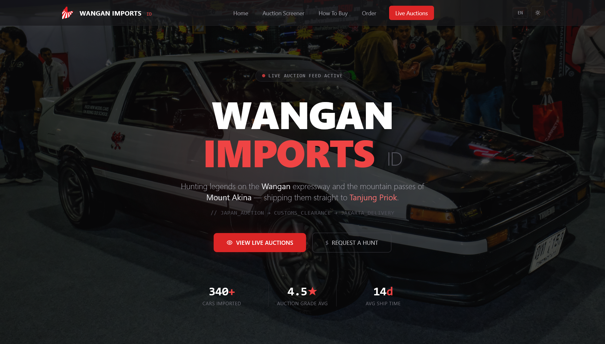
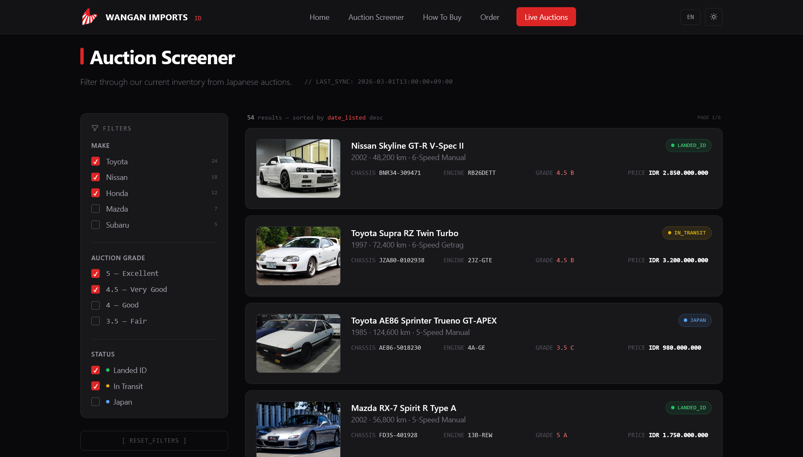

# Web Application Development Assignment 1: HTML & CSS

**Live Demo:** [Wangan Imports ID - Live Website](https://alifnw.github.io/web-app-dev-assignment-html-css/)

## Author Information
- **Name:** Alif Negifta Wibawaputra
- **NIM:** 245150200111066
- **Study Program:** Teknik Informatika

## Project Overview
This repository contains the source code for the first assignment of the Web Application Development course (Pengembangan Aplikasi Web). The project is a front-end implementation of "Wangan Imports ID", a premium JDM vehicle import service website tailored for the Indonesian market.

## Visual Preview

*Click the dropdowns below to expand the interface screenshots.*

  
<strong>Hero Section & Landing Page</strong>

   
  

  
<strong>Live Auction Screener</strong>

   
  

## Fulfillment of Assignment Requirements

**1. Multiple Connected Pages**
The website consists of two distinct HTML pages connected via hyperlinks in the navigation bar:
- `index.html`: The main landing page, featuring the hero section, live auction screener, dispatch order form, and video showcase.
- `how-to-buy.html`: A detailed step-by-step guide explaining the vehicle import process, including specific Indonesian customs (Bea Cukai) regulations and required documents.

**2. CSS Framework Utilization**
This project is built using Tailwind CSS via CDN. It relies entirely on the framework for layout, styling, and responsiveness, avoiding the need for extensive custom external CSS files.

**3. Framework Features Applied**
- **Layout System:** Extensive use of CSS Grid (`grid-cols-1`, `lg:grid-cols-4`) and Flexbox (`flex`, `justify-between`, `items-center`) to structure internal components and page sections.
- **Utility Classes:** Application of Tailwind's utility-first classes for spacing (`px-4`, `py-16`), typography (`font-sans`, `tracking-tight`), sizing, and colors (`bg-zinc-950`, `text-red-600`).
- **Interactive States:** Implementation of pseudo-class variants such as `hover:`, `focus:`, and `group-hover:` for smooth transitions and interactive elements.
- **Dark Mode Support:** Implementation of Tailwind's 'class' dark mode strategy to support a fully functional dark and light theme toggle across all pages.

**4. Responsive Design**
The user interface is fully responsive and automatically adapts to different screen sizes using Tailwind's responsive breakpoints (`sm:`, `md:`, `lg:`):
- **Mobile View:** Features a collapsible hamburger navigation menu, single-column stacked grids, and appropriately sized touch targets.
- **Desktop View:** Features a horizontal navigation bar, multi-column grid layouts for the auction screener and footer, and larger typography.

**5. GitHub Repository Submission**
The complete source code is uploaded to a public GitHub repository, fulfilling the requirement for online version control submission.

## Technology Stack Application

- **HTML5:** Used for the semantic layout and structural foundation of the application. Custom `data-lang-*` attributes are utilized to facilitate the client-side localization logic.
- **Tailwind CSS:** Used as the primary styling framework to rapidly build the UI directly within the HTML markup, ensuring consistency and responsive design.
- **Vanilla JavaScript:** A minimal script is included at the bottom of the files to handle essential interactivity. This includes managing the mobile navigation menu toggle, executing the dark/light theme switch (persisted via standard Window localStorage), running the English/Indonesian language translation toggle, handling form submission dummy states, and controlling the automatic background image slideshow in the hero section.

## Quick Start
To run this project locally:
1. Clone this repository.
2. Open `index.html` directly in your web browser. 
3. No build process or package installation is required as Tailwind CSS is served via CDN.

## License & Copyright Disclaimer
The source code (HTML, CSS, JavaScript) in this repository is licensed under the [MIT License](LICENSE). 

**Disclaimer:** All vehicle images, logos, and specific branding used within this project are the property of their respective copyright holders. They are used strictly for **educational and non-commercial purposes** as part of a university web development assignment. This repository does not claim ownership over these visual assets, and the MIT License does not apply to them.
